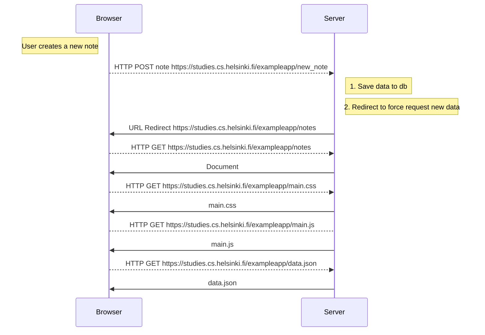

# 0.4: New Note

```mermaid
sequenceDiagram
    Note left of Browser: User creates a new note
    Browser-->>Server: HTTP POST note https://studies.cs.helsinki.fi/exampleapp/new_note
    Note right of Server: 1. Save data to db
    Note right of Server: 2. Redirect to force request new data
    Server->>Browser: URL Redirect https://studies.cs.helsinki.fi/exampleapp/notes
    Browser-->>Server: HTTP GET https://studies.cs.helsinki.fi/exampleapp/notes
    Server->>Browser: Document
    Browser-->>Server: HTTP GET https://studies.cs.helsinki.fi/exampleapp/main.css
    Server->>Browser: main.css
    Browser-->Server: HTTP GET https://studies.cs.helsinki.fi/exampleapp/main.js
    Server->>Browser: main.js
    Browser-->>Server: HTTP GET https://studies.cs.helsinki.fi/exampleapp/data.json
    Server->>Browser: data.json
```
